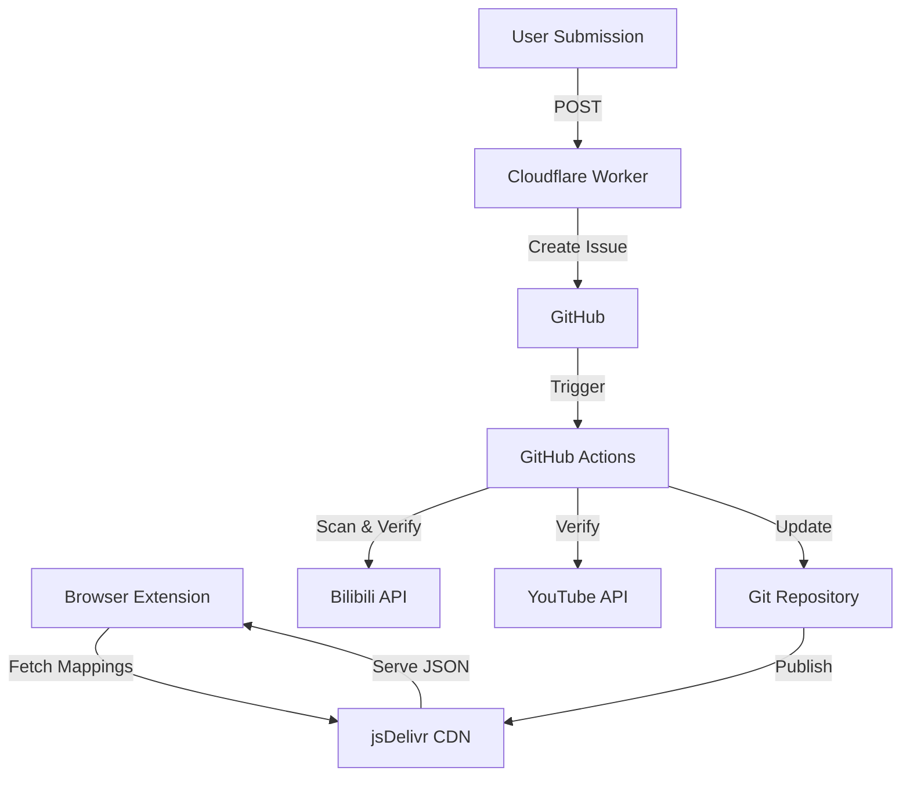

# BiliTube-Wormhole

<div align="center">


**A serverless bridge between Bilibili and YouTube with automated user mapping and danmaku synchronization**

[](https://opensource.org/licenses/MIT)
[](https://www.typescriptlang.org/)
[](https://bun.sh/)

[Features](#features) • [Installation](#installation) • [Usage](#usage) • [Contributing](#contributing)

</div>

## Features

### 🌉 Cross-Platform Navigation

- **Bilibili → YouTube**: Show YouTube logo on Bilibili user pages with direct channel links
- **YouTube → Bilibili**: Show Bilibili logo on YouTube channels with direct space links
- Seamless switching between platforms for better quality or interaction

### 🎯 Automated User Mapping

- **Daily Scanning**: Automatically scan Bilibili hot rankings, must-watch list, and top creators
- **Cold Start**: Initial scan of top 100 creators and popular users (100k+ followers)
- **Smart Deduplication**: Avoid duplicate processing across different ranking lists

### 🔍 Multi-Level Verification

1. **Level 1** (95%+ confidence): YouTube verified channel + name match
2. **Level 2** (85%+ confidence): Cross-platform bio mentions
3. **Level 3** (70%+ confidence): Username, avatar, video similarity
4. **Level 4**: Manual review for edge cases

### 💬 Danmaku Synchronization

- Fetch Bilibili danmaku and display on YouTube videos
- Bilibili-style rendering with scrolling, top, and bottom positioning
- Authentic font, colors, and animations

### 🚀 Serverless Architecture

- **GitHub Actions**: Automated workflows for scanning and verification
- **Cloudflare Workers**: User submission endpoint with rate limiting
- **jsDelivr CDN**: Fast global delivery of mapping data
- **Zero hosting costs**: No server required!

### 📊 Git-Style Sharded Storage

- Efficient hash-based directory structure (inspired by Git objects)
- O(1) lookup performance
- Bidirectional mapping (Bilibili ↔ YouTube)

## Installation

### Browser Extension

#### Chrome/Edge

1. Download the latest release from [Releases](https://github.com/palemoky/BiliTube-Wormhole/releases)
2. Extract the ZIP file
3. Open `chrome://extensions/`
4. Enable "Developer mode"
5. Click "Load unpacked" and select the extracted folder

#### Firefox

1. Download the Firefox version from [Releases](https://github.com/palemoky/BiliTube-Wormhole/releases)
2. Open `about:addons`
3. Click the gear icon → "Install Add-on From File"
4. Select the downloaded XPI file

### Development Setup

```bash
# Clone the repository
git clone https://github.com/palemoky/BiliTube-Wormhole.git
cd BiliTube-Wormhole

# Install dependencies
bun install

# Start development mode
bun run dev

# Build for production
bun run build
```

## Usage

### For Users

1. **Install the browser extension** (see Installation above)
2. **Browse Bilibili or YouTube** as usual
3. **See platform logos** on user/channel pages with known mappings
4. **Click logos** to switch platforms instantly
5. **Watch YouTube videos** with Bilibili danmaku (if available)

### Submit a Mapping

If you know a Bilibili user who also has a YouTube channel:

1. Visit our [submission page](https://your-worker-url.workers.dev)
2. Enter the Bilibili UID and YouTube Channel ID
3. Submit - our system will verify automatically!

### For Developers

#### Run Workflows Locally

```bash
# Scan Bilibili users
BILIBILI_SESSDATA=your_sessdata bun run workflow:scan

# Verify mappings
BILIBILI_SESSDATA=your_sessdata \
YOUTUBE_API_KEY=your_api_key \
USERS_JSON='[{"uid":"123456"}]' \
bun run workflow:verify
```

#### Deploy Cloudflare Worker

```bash
cd worker
bun install

# Set secrets
wrangler secret put GITHUB_TOKEN

# Deploy
bun run worker:deploy
```

## Architecture



### Data Flow

1. **Daily Scan**: GitHub Actions runs at 00:00 UTC
2. **User Discovery**: Scan Bilibili rankings for new users
3. **Verification**: Multi-level confidence scoring
4. **Storage**: Write to sharded JSON files
5. **CDN**: Publish to jsDelivr for global access
6. **Extension**: Fetch and display mappings

## Contributing

We welcome contributions! Here's how you can help:

### Submit User Mappings

Know a creator on both platforms? Submit a mapping!

### Report Issues

Found a bug or incorrect mapping? [Open an issue](https://github.com/palemoky/BiliTube-Wormhole/issues)

### Contribute Code

1. Fork the repository
2. Create a feature branch (`git checkout -b feature/amazing-feature`)
3. Commit your changes (`git commit -m 'Add amazing feature'`)
4. Push to the branch (`git push origin feature/amazing-feature`)
5. Open a Pull Request

## Configuration

### Environment Variables

#### GitHub Actions

- `BILIBILI_SESSDATA`: (Optional) Bilibili session cookie
  - **When needed**: For WBI-authenticated endpoints or to avoid rate limits
  - **Can skip**: Basic user info and public rankings work without it
  - **How to get**: Login to Bilibili → F12 → Application → Cookies → SESSDATA
- `YOUTUBE_API_KEY`: YouTube Data API v3 key (Required)
- `GITHUB_TOKEN`: Automatically provided by GitHub Actions

#### Cloudflare Worker

- `GITHUB_TOKEN`: GitHub personal access token
- `GITHUB_OWNER`: Repository owner (default: `palemoky`)
- `GITHUB_REPO`: Repository name (default: `BiliTube-Wormhole`)

## API Quota Management

### YouTube Data API

- **Free Tier**: 10,000 units/day
- **Search Cost**: ~100 units per search
- **Strategy**: Use time-based processing, prioritize high-confidence matches

### Bilibili API

- **No official limits** but use rate limiting to avoid anti-bot measures
- **Default delay**: 1000ms between requests

## License

This project is licensed under the MIT License - see the [LICENSE](LICENSE) file for details.

## Acknowledgments

- [bilibili-youtube-danmaku](https://github.com/palemoky/bilibili-youtube-danmaku) - Original inspiration
- [WXT Framework](https://wxt.dev/) - Modern browser extension framework
- [Bun](https://bun.sh/) - Fast JavaScript runtime

## Support

- 📧 Email: your-email@example.com
- 💬 Discussions: [GitHub Discussions](https://github.com/palemoky/BiliTube-Wormhole/discussions)
- 🐛 Issues: [GitHub Issues](https://github.com/palemoky/BiliTube-Wormhole/issues)

---

<div align="center">

Made with ❤️ by the BiliTube-Wormhole team

[⬆ Back to Top](#bilitube-wormhole)

</div>
